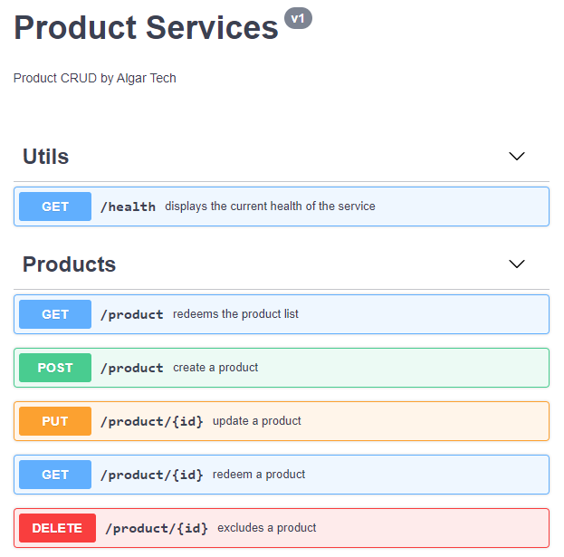

# Desafio - FullStack

Parabéns, você passou para a segunda fase do processo seletivo da AlgarTech para vaga de pessoa Desenvolvedora em FullStack / URA. Agora é hora de colocar a mão na massa!

## Passos a seguir

1. Criar um **fork** deste repositório e implementar a aplicação conforme instruções abaixo.
2. Abrir um **merge request** para este repositório para que possamos avaliar o seu código.
3. Enviar um e-mail para nataliamam@algartech.com
4. Assunto: “[Teste Full Stack] - Seu nome” 
5. Corpo do e-mail:  Link do seu merge resquest

É hora de brilhar ⭐

## Instruções / Resumo

Você foi escolhido para escrever uma PoC (Prova de Conceito) de uma pequena API que realiza um CRUD de produtos e possui um método para geração de frases (piadas).

## Seguem os requisitos

A linguagem de programação a ser utilizada poderá ser javascript ou .Net, é necessário que a Stack possua as características a seguir:

* Banco de dados - NoSQL (MongoDB) ou MySQL. Recomendamos colocar o banco de dados dentro da solução (docker-compose) ou utilizar o [Atlas](https://cloud.mongodb.com/)
* Swagger da aplicação (Em: http://localhost:porta/swagger )
* Solução entregue no formato Docker (DockerFile da solução)
* Todas as informações dos produtos precisam ser persistidos no banco de dados escolhido.
* Documento descrevendo o processo de instalação do sistema. (Possíveis scripts ou comandos para subir a aplicação)
* O fluxo de autenticação (usuários do sistema "/auth" ) é opcional, o mesmo poderá ser mockado para andamento do projeto. Você pode usar criar uma key-value que servirá como autenticação. O importante neste teste é que os métodos sejam minimamente autenticados. Caso decida utilizar uma autenticação sugerimos que utilize o esquema com tokens JWT com usuários e credenciais na base de dados.

* O sistema é composto por 1 micro serviço (API para o Crud de produtos REST acrescido de um método gerador de piadas):  
  * Campos: Nome, Descrição, Preço, Data de Criação, Data de Atualização, Criado Por, Atualizado Por e outros campos que achar convenientes para o  problema.
  * Métodos / Autenticação
    * Create Produto -  necessário autenticação para inserção de itens
    * Read Produto - não é necessário autenticação para leitura de item
    * Read Produtos - não é necessário autenticação para leitura de itens
    * Update Produto - necessário autenticação para atualização de itens
    * Delete Produto - necessário autenticação para exclusão de itens
    * Health - método que retornará statusCode 200 e body "{status: up}" caso serviço esteja disponível. 
    * Read Joke - não é necessário autenticação para leitura da joke, porém a mesma deverá buscar uma joke através de um get em: https://api.chucknorris.io/jokes/random e retornar apenas o campo 'value'. Dessa forma a responsabilidade e logica da geração de piadas está vinculada a um serviço externo.
    * Auth - opcional (método para autenticação do usuário) 

### Exemplo do swagger

## Diferenciais

* Desenho arquitetural simples
* Escrita de testes
* Segurança na autenticação e acesso aos métodos
* Front-end no framework que desejar

## Critérios de Avaliação

* Organização do projeto
* Utilização de padrões arquiteturais
* Clareza do código
* Escolha de estruturas e bibliotecas
* Ausência de crashs e bugs
* Linguagem de programação Javascript ou .Net

## Dúvidas?

Entre em contato pelo email nataliamam@algartech.com

Boa Sorte 🙏

